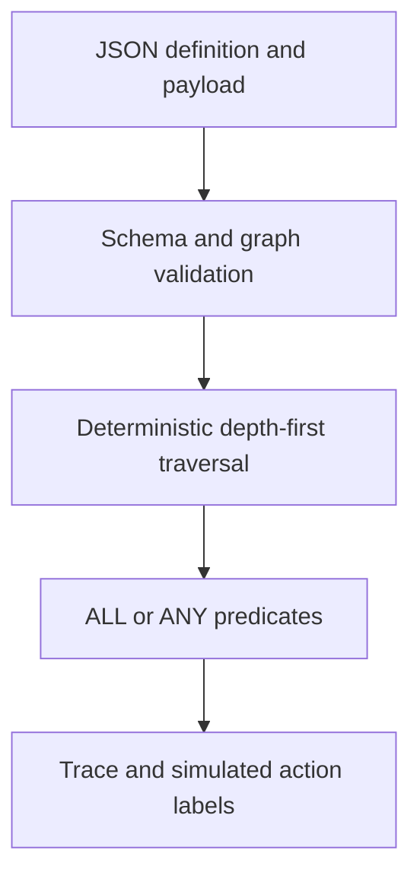

# Automation Node Interpreter

A typed JSON flow interpreter with strict predicates, graph validation and an inspectable execution trace.

**Source:** https://github.com/Santoszoi/marcos-repositorio/tree/main/automation-node-interpreter

The interface is in Portuguese; this technical documentation is in English. All examples are fictional. Built with Next.js App Router, React, TypeScript and Tailwind CSS. The deployment is a static export; engine logic runs in the browser without a backend.

## Architecture

### Interpreter pipeline



`src/lib/automationNodeEngine.ts` defines conditions, discriminated node types, flow/payload validation and execution. `src/lib/examples.ts` supplies a six-node commercial example and three payload scenarios. The page separates the edited JSON from the last valid graph, displays unapplied changes and clears stale execution results when inputs change.

Definitions contain an `entryId` and 1–50 nodes. A condition node has `matchType`, `conditions`, `actionToTrigger`, `onMatch` and `onMiss`. An action node has `actionToTrigger` and `next`. Identifiers are bounded, simple ASCII strings and exclude prototype-related names. Each edge list allows at most ten unique destinations; condition lists allow at most twenty predicates.

Validation rejects unknown properties, duplicate IDs, invalid operators, missing destinations, disconnected nodes and cycles, including problems on a currently unselected branch. A color-marked DFS detects cycles; reachability starts at the entry. Graph validation is O(V + E + C), where C is condition validation cost, under the configured bounds.

Execution is deterministic depth-first traversal in declared edge order. A visited set executes each node at most once, including converging branches. This is **not a parallel join barrier**: a shared destination can execute before another branch reaches it. Conditions use strict primitive equality, actual finite-number comparisons and case-insensitive text matching. Missing fields fail. ALL means every condition, ANY means at least one; an empty condition list always fails.

A matching condition records its action label and selects `onMatch`; a nonmatch selects `onMiss` without recording that label. Action nodes always record their label. Execution returns `{ actions, trace, visitedNodes }` without mutating inputs. Traversal is O(V + E + C), excluding string-comparison lengths.

### Public API

- `evaluateCondition(data, condition)` and `evaluateNodeRules(data, node)` evaluate predicates.
- `validateFlow(value)` validates and clones a graph.
- `validatePayload(value)` accepts up to 100 primitive fields with bounded strings.
- `executeFlow(payload, definition)` returns selected-path traces and labels.
- `parseFlowJson(source)` parses JSON capped at 30,000 characters.

### Try the interface

Load priority, contact or manual-review scenarios; run the flow and inspect visited nodes and selected paths. Edit the definition JSON, validate/apply it, or run the current editor contents directly. Invalid graph changes show an error while preserving the last valid visualization.

### Boundaries

Actions are **simulated labels only**. The interpreter does not execute supplied JavaScript, send messages, perform checkout or call external APIs. It accepts acyclic graphs and flat primitive payloads, not arbitrary nested expressions. A production action adapter would need authorization, idempotency, retries and durable execution state. All edits/results are local to this page session.

### Tests

Nine tests cover strict ALL/ANY semantics, primitive comparisons and own fields, example traces, cycles/dangling connections, duplicate IDs/entry/reachability, invalid unselected branches, converging-node execution, immutability and input bounds.

## Source layout

| Path                                             | Responsibility                                                         |
| ------------------------------------------------ | ---------------------------------------------------------------------- |
| `src/app/page.tsx`                               | Interactive state, event handlers and demo presentation                |
| `src/app/layout.tsx`                             | Portuguese document language and metadata                              |
| `src/app/globals.css`                            | Tailwind import, responsive layout and project theme                   |
| `src/components/EngineShell.tsx`                 | Shared branding, source and documentation links                        |
| `src/lib/`                                       | Typed engine and fictional examples |
| `tests/`                                         | Domain tests using Node's test runner and tsx                          |
| `scripts/check-export.mjs`                       | Production HTML, favicon and referenced-asset checks                   |
| `Dockerfile`, `nginx.conf`, `docker-compose.yml` | Multi-stage static production container                                |

## Run locally

Use Node.js 24 and npm. From this project's directory:

```bash
npm ci
npm run dev
```

Open http://localhost:3000. To validate production output:

```bash
npm test
npm run build
npm run typecheck
node scripts/check-export.mjs
```

`npm run build` generates `out/`. No environment variables, credentials or external APIs are required. The package lock is committed for reproducible installs.

## Docker

```bash
docker compose up --build
```

Open http://localhost:3000. The build stage uses Node.js 24; the runtime serves only exported assets through Nginx on container port 8080. Compose binds locally to 127.0.0.1. A health check verifies the root page; the runtime does not run a development server.

## Verification and accessibility

The repository's `engines-ci.yml` runs tests, production build, TypeScript checks, static asset checks and container HTTP checks for each engine. HTTP checks establish route/asset availability; they are not browser interaction tests. Automated browser visual/interaction QA was unavailable during preparation and is not claimed here.

Forms have associated labels, buttons expose their action, result regions announce updates, error messages use alert/status semantics and controls retain visible focus styling. Responsive layouts collapse on narrow screens. Keyboard and assistive-technology testing remains a separate manual verification step.

## Security and production scope

No real credentials or customer data are included. User-supplied text is rendered through React's normal escaping; no `eval` or injected HTML is used. These demos demonstrate domain algorithms and controlled front-end state. They do not include accounts, durable persistence or shared multi-user authorization. See the engine-specific boundaries above before adopting the code in a production system.
