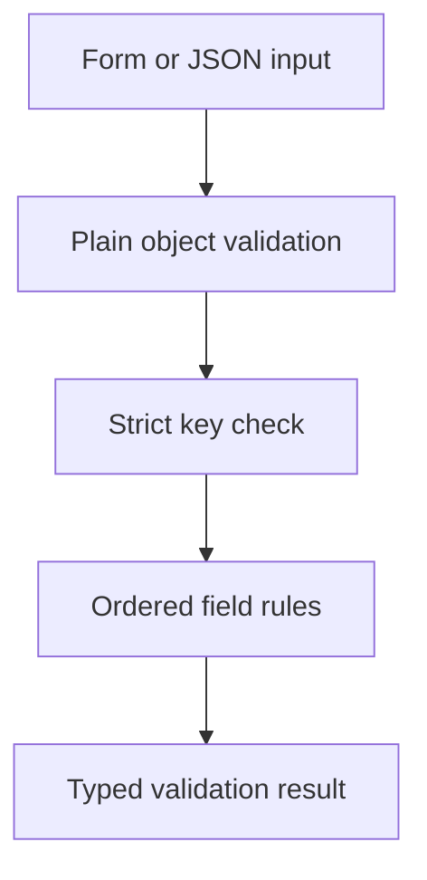

# Form Schema Validator

A lightweight custom form validation engine built from scratch in TypeScript, without validation libraries such as Zod or Yup. It demonstrates composable higher-order functions, immutable input handling and structural validation through an interactive React form/JSON workbench.

**Live demo:** https://form-schema-validator-marcos.marcosmiguel-emily.chatgpt.site  
**Source:** https://github.com/Santoszoi/marcos-repositorio/tree/main/form-schema-validator

The interface is in Portuguese; this technical documentation is in English. All examples are fictional. Built with Next.js App Router, React, TypeScript and Tailwind CSS. The deployment is a static export; engine logic runs in the browser without a backend.

## Key architectural features

- **Dependency-free engine:** The validation module uses native TypeScript and JavaScript. The demo application has React, Next.js and tooling dependencies.
- **Higher-order functions:** Rule factories produce reusable validation functions that can be composed into field schemas.
- **Typed contracts:** TypeScript generics connect schema fields to typed error maps; runtime checks validate untrusted input.
- **First-error short-circuiting:** Ordered loops stop after the first failing rule per field while collecting errors across fields.
- **Strict input structure:** Unknown keys, forbidden prototype-related keys and non-plain objects are rejected.
- **Immutable evaluation:** Validation returns a new result without modifying the supplied data.

## Tech stack

| Layer | Technology |
| --- | --- |
| Validation engine | TypeScript and native JavaScript |
| Interactive demo | React, Next.js App Router and Tailwind CSS |
| Unit tests | Node.js test runner, node:assert/strict and tsx |
| Continuous integration | GitHub Actions: tests, type checks, static build and Docker HTTP checks |
| Production container | Multi-stage Docker build and Nginx |

## Usage example

```ts
import {
  required,
  isEmail,
  minLength,
  validateSchema,
  type SchemaDefinition,
} from "./src/lib/schemaValidator";

interface ContactForm {
  name: string;
  email: string;
}

const schema: SchemaDefinition<ContactForm> = {
  name: [required(), minLength(3)],
  email: [required(), isEmail()],
};

const result = validateSchema<ContactForm>(
  { name: "Marcos", email: "marcos@example.com" },
  schema,
);
// result.isValid === true; result.errors is empty.
```

## Architecture

### Validation pipeline



`src/lib/schemaValidator.ts` implements higher-order validation rules and the generic schema evaluator. `src/lib/exampleSchema.ts` defines the registration schema and configurable options. The React page owns input and schema-option state; results are recomputed on explicit validation and cleared when inputs change.

Rules accept `unknown` and return an error string or `null`. Optional format/length rules skip empty values; combine them with `required()` when presence is mandatory. Presence treats whitespace-only strings as empty while accepting zero and false. Format and range rules check actual types rather than coercing arbitrary values.

`validateSchema<T>(data, schema)` checks a plain object, rejects unknown or forbidden keys, and runs each field's rules in order, stopping at that field's first error. It returns `{ isValid, errors, formError?, unknownKeys }`. Error maps use a null prototype and inputs remain unchanged. Complexity is O(K + F + R), plus the cost of individual rule evaluations, where K is the input-key count, F the schema-field count and R the number of rules evaluated.

### Public API

- `required(message?)`, `isEmail(message?)`, `minLength(min, message?)`, `maxLength(max, message?)`.
- `securePassword(message?)` demonstrates uppercase/lowercase/digit composition.
- `numberRange(min, max, message?)` and `integer(message?)` require actual finite numbers.
- `validateSchema<T>(data, schema)` evaluates typed schemas without mutating inputs.
- `parseJsonObject(source)` parses JSON with a 10,000-character limit; the evaluator subsequently checks its shape.

### Try the interface

Switch between a form and JSON, load valid/invalid examples, adjust required length and password/email rules, then inspect field errors and the structured result. A password input is masked in the form; JSON mode displays the fictional example explicitly. Values are never persisted or sent to an API.

### Boundaries

This is structural validation, not HTML sanitization, authentication or proof of password security. The composition rule is an educational rule, not a complete production password policy. Email syntax checks do not verify ownership or delivery. Repeat validation at the server trust boundary in a real application. Rule functions are trusted developer code; accept serialized JSON rather than arbitrary objects with executable accessors. Length rules use JavaScript UTF-16 string length. Schema configuration rejects invalid limits; plain objects, arrays and additional keys are handled explicitly.

### Tests

Eight tests cover whitespace and presence, email/password end anchors, immutable errors, first-error short-circuiting, finite numbers and configuration limits, strict keys and object shape, JSON limits and optional fields.

## Source layout

| Path                                             | Responsibility                                                         |
| ------------------------------------------------ | ---------------------------------------------------------------------- |
| `src/app/page.tsx`                               | Interactive state, event handlers and demo presentation                |
| `src/app/layout.tsx`                             | Portuguese document language and metadata                              |
| `src/app/globals.css`                            | Tailwind import, responsive layout and project theme                   |
| `src/components/EngineShell.tsx`                 | Shared branding, source and documentation links                        |
| `src/lib/`                                       | Typed engine, fictional examples and optional read-only WebMCP adapter |
| `tests/`                                         | Domain tests using Node's test runner and tsx                          |
| `scripts/check-export.mjs`                       | Production HTML, favicon and referenced-asset checks                   |
| `Dockerfile`, `nginx.conf`, `docker-compose.yml` | Multi-stage static production container                                |

## Run locally

Use Node.js 24 and npm. This project is a folder in the public portfolio repository:

```bash
git clone https://github.com/Santoszoi/marcos-repositorio.git
cd marcos-repositorio/form-schema-validator
npm ci
npm run dev
```

Open http://localhost:3000. To validate production output:

```bash
npm test
npm run build
npm run typecheck
node scripts/check-export.mjs
```

`npm run build` generates `out/`. No environment variables, credentials or external APIs are required. The package lock is committed for reproducible installs.

## Docker

```bash
docker compose up --build
```

Open http://localhost:3000. The build stage uses Node.js 24; the runtime serves only exported assets through Nginx on container port 8080. Compose binds locally to 127.0.0.1. A health check verifies the root page; the runtime does not run a development server.

## Verification and accessibility

The repository's `engines-ci.yml` runs tests, production build, TypeScript checks, static asset checks and container HTTP checks for each engine. HTTP checks establish route/asset availability; they are not browser interaction tests. Automated browser visual/interaction QA was unavailable during preparation and is not claimed here.

Forms have associated labels, buttons expose their action, result regions announce updates, error messages use alert/status semantics and controls retain visible focus styling. Responsive layouts collapse on narrow screens. Keyboard and assistive-technology testing remains a separate manual verification step.

## Optional read-only WebMCP

`src/lib/webmcp.ts` feature-detects `document.modelContext` and registers a read-only summary/trace tool with an empty input schema. Unsupported browsers continue normally. Registration is cleaned up when the component unmounts. Tools do not modify reservations, validate new user input, expose password values or trigger actions. WebMCP browser execution was not independently tested.

## Security and production scope

No real credentials or customer data are included. User-supplied text is rendered through React's normal escaping; no `eval` or injected HTML is used. These demos demonstrate domain algorithms and controlled front-end state. They do not include accounts, durable persistence or shared multi-user authorization. See the engine-specific boundaries above before adopting the code in a production system.

## Connect

[Email](mailto:marcosrony.neves@gmail.com) · [LinkedIn](https://www.linkedin.com/in/marcos--neves) · [Portfolio](https://marcossolutions.com.br)
