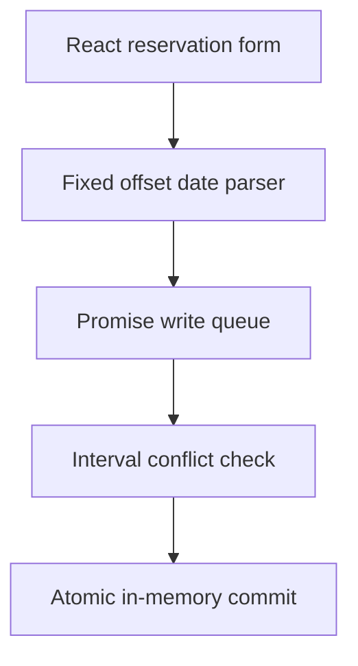

# Scheduler Time Engine

An interactive reservation lab demonstrating interval overlap detection, immutable snapshots and serialized asynchronous writes.

**Live demo:** https://scheduler-time-engine-marcos.marcosmiguel-emily.chatgpt.site  
**Source:** https://github.com/Santoszoi/marcos-repositorio/tree/main/scheduler-time-engine

The interface is in Portuguese; this technical documentation is in English. All examples are fictional. Built with Next.js App Router, React, TypeScript and Tailwind CSS. The deployment is a static export; engine logic runs in the browser without a backend.

## Architecture

### Reservation lifecycle



`src/lib/schedulerEngine.ts` contains the domain model, validation, conflict queries, grouping and the `SchedulerEngine` class. `src/lib/examples.ts` supplies fictional resources and reservations. The page owns one engine instance and renders its snapshots; derived counters and agenda entries do not become a second authoritative store.

Intervals are half-open: **[start, end)**. Two reservations overlap exactly when `startA < endB && endA > startB`, provided they use the same resource. Adjacent reservations are allowed. Conflict lookup scans N reservations in O(N) time. Grouping uses a null-prototype record and sorts each group once; worst-case sorting is O(N log N).

Every write is appended to a promise queue. Input dates are copied before queuing; returned reservations and snapshots are copied again. A rejected operation does not poison the queue. A batch of 1–20 reservations is checked against a candidate snapshot, including earlier entries in the batch, and committed only after every entry passes. A failed batch leaves the original state untouched. Batch validation is O(BN + B²), excluding snapshot copies.

### Public API

- `findSchedulingConflicts(input, slots)` returns matching reservations as defensive copies.
- `hasSchedulingConflict(input, slots)` returns a boolean.
- `sortAndGroupSlots(slots)` returns resource groups sorted by start timestamp and ID.
- `new SchedulerEngine(seed)` validates unique IDs and a conflict-free seed.
- `reserve(input)` and `reserveBatch(inputs)` return promises of created reservations.
- `cancel(id)` serializes deletion; `snapshot()` returns a defensive copy.
- `parseDemoDateTime(text)` validates wall-clock components and applies the demo's explicit UTC−03:00 offset.

### Try the interface

Reserve an interval, check its conflicts, cancel a reservation, or race two requests for the same free interval. Exactly one racing request succeeds within this instance; if the interval is already occupied, both fail. Restore examples to start again. The agenda and counters reflect committed reservations.

### Boundaries

Concurrency protection applies to **one in-memory engine instance**. Different tabs, processes and servers do not share its queue. Reloading clears user changes. Production booking requires a shared database with transactional conflict enforcement; this demo does not provide distributed locking. Dates use a fixed offset, not historical IANA time-zone rules or daylight-saving transitions. No external calendar is modified.

### Tests

Eight tests cover adjacency and resource isolation, overlap shapes, invalid intervals, stable grouping and defensive copies, concurrent writes and queue recovery, batch rollback, pending-input mutations and calendar validation.

## Source layout

| Path                                             | Responsibility                                                         |
| ------------------------------------------------ | ---------------------------------------------------------------------- |
| `src/app/page.tsx`                               | Interactive state, event handlers and demo presentation                |
| `src/app/layout.tsx`                             | Portuguese document language and metadata                              |
| `src/app/globals.css`                            | Tailwind import, responsive layout and project theme                   |
| `src/components/EngineShell.tsx`                 | Shared branding, source and documentation links                        |
| `src/lib/`                                       | Typed engine, fictional examples and optional read-only WebMCP adapter |
| `tests/`                                         | Domain tests using Node's test runner and tsx                          |
| `scripts/check-export.mjs`                       | Production HTML, favicon and referenced-asset checks                   |
| `Dockerfile`, `nginx.conf`, `docker-compose.yml` | Multi-stage static production container                                |

## Run locally

Use Node.js 24 and npm. From this project's directory:

```bash
npm ci
npm run dev
```

Open http://localhost:3000. To validate production output:

```bash
npm test
npm run build
npm run typecheck
node scripts/check-export.mjs
```

`npm run build` generates `out/`. No environment variables, credentials or external APIs are required. The package lock is committed for reproducible installs.

## Docker

```bash
docker compose up --build
```

Open http://localhost:3000. The build stage uses Node.js 24; the runtime serves only exported assets through Nginx on container port 8080. Compose binds locally to 127.0.0.1. A health check verifies the root page; the runtime does not run a development server.

## Verification and accessibility

The repository's `engines-ci.yml` runs tests, production build, TypeScript checks, static asset checks and container HTTP checks for each engine. HTTP checks establish route/asset availability; they are not browser interaction tests. Automated browser visual/interaction QA was unavailable during preparation and is not claimed here.

Forms have associated labels, buttons expose their action, result regions announce updates, error messages use alert/status semantics and controls retain visible focus styling. Responsive layouts collapse on narrow screens. Keyboard and assistive-technology testing remains a separate manual verification step.

## Optional read-only WebMCP

`src/lib/webmcp.ts` feature-detects `document.modelContext` and registers a read-only summary/trace tool with an empty input schema. Unsupported browsers continue normally. Registration is cleaned up when the component unmounts. Tools do not modify reservations, validate new user input, expose password values or trigger actions. WebMCP browser execution was not independently tested.

## Security and production scope

No real credentials or customer data are included. User-supplied text is rendered through React's normal escaping; no `eval` or injected HTML is used. These demos demonstrate domain algorithms and controlled front-end state. They do not include accounts, durable persistence or shared multi-user authorization. See the engine-specific boundaries above before adopting the code in a production system.
